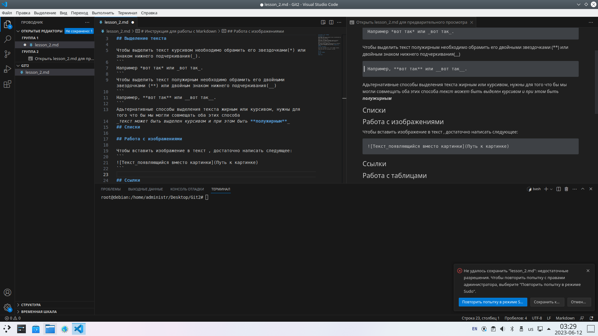

# Инструкция для работы с Markdown

## Выделение текста

Чтобы выделить текст курсивом необходимо обрамить его звездочками(*) или знаком нижнего подчеркивания(_).
```
Например *вот так* или _вот так_.
```
Чтобы выделить текст полужирным необходимо обрамить его двойными звездочками (**) или двойным знаком нижнего подчеркивания(__)
```
Например, **вот так** или __вот так__.
```
Адьтернативные способы выделения текста жирным или курсивом, нужны для того что бы мы могли совмещать оба этих способа
_текст может быть выделен курсивом и при этом быть **полужирным**_
## Списки

Что бы добавить ненумерованные списки, необходимо пункты выделить звездочкой(*) или знаком (+).
Например, вот так:
* Элемент 1
* Элемент 2
* Элемент 3
+ Элемент 4

Что бы добавить нумерованные списки, необходимо пункты просто пронумеровать.
Например, вот так:
1. Первый пункт
2. Второй пункт

## Работа с изображениями

Чтобы вставить изображение в текст , достаточно написать следующее:
```

```


## Ссылки


## Работа с таблицами

<<<<<<< HEAD
В чистом Маркдауне нет синтаксиса для таблиц, а в GFM есть.

First Header  | Second Header
------------- | -------------
Content Cell  | Content Cell
Content Cell  | Content Cell

Для красоты можно и по бокам линии нарисовать:

| First Header  | Second Header |
| ------------- | ------------- |
| Content Cell  | Content Cell  |
| Content Cell  | Content Cell  |

Можно управлять выравниванием столбцов при помощи двоеточия.

| Left-Aligned  | Center Aligned  | Right Aligned |
|:------------- |:---------------:| -------------:|
| col 3 is      | some wordy text |     **$1600** |
| col 2 is      | centered        |         $12   |
| zebra stripes | are neat        |        ~~$1~~ |

Внутри таблиц можно использовать ссылки, наклонный, жирный или зачеркнутый текст.

Для всего остального есть обычный HTML.


## Изначальный код
=======
## Исходный код
В чистом Маркдауне блоки кода отбиваются 4 пробелами в начале каждой строки.

Но в GitHub-Flavored Markdown (сокращенно GFM) есть более удобный способ: ставим по три апострофа (на букве Ё) до и после кода. Также можно указать язык исходного кода.
```python
async def chiter(ctx):
    await ctx.send("Hello")
```
>>>>>>> source_code


## Заключение
